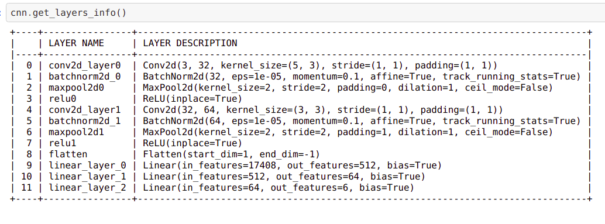
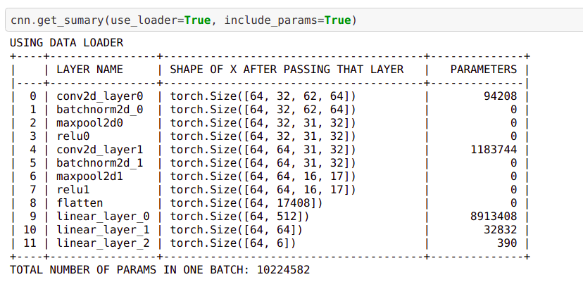
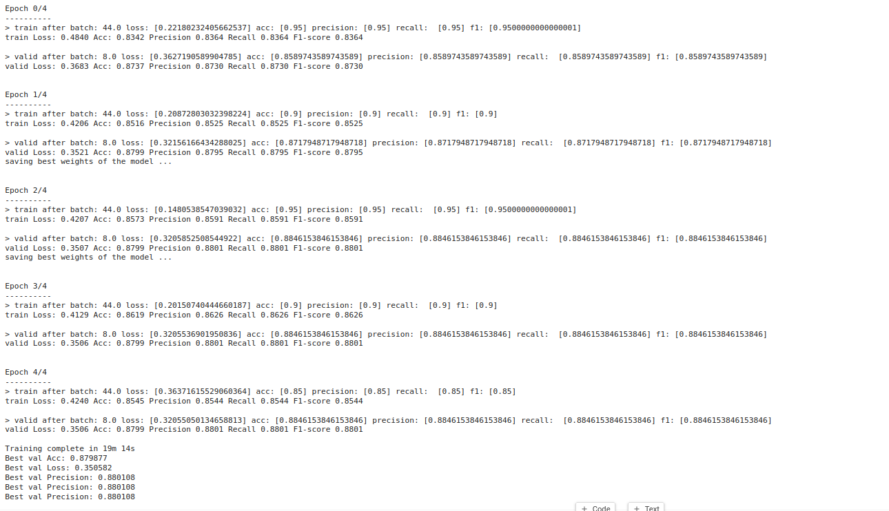

# AbstractTorch

 


How, would it feel, if we could save some of the time of writting the long codes of pytorch, and would complete the full process in 10-15 lines
like keras, but have same kind of customization and features like pytorch and would be running pytorch in the backend at the same time, then it would be 
really cool. Yeah, its true that pytorch lightning is already present, but home made things has its own vibes.... 😅😁.


### Features to be expected right now, in this version:
1. smaller code and abstraction like keras
2. auto training, no another scripts are needed to write for the training and the evaluation process.
3. supporting almost all kinds of layers, ranging from ANN, CNN, RNN etc. (RNN, LSTM RNN, VAE, GNNs are comming soon)
4. A genaralised dataset class that can take any raw path, folders, files and would return a fully furbished dataset (comming soon)

### Why to use this module ? 

1. If you wanna test different architectures in short period of time, and train them easily as possible but with full results, dont worry
AbstractTorch got that for you.

2. If we want to make our very own unique model through a separate class, but wanna train it and dont wanna write that code, dont worry
the `TorchTrain` class got that for you, to train any kind of model supporting pytorch can train that for you.

3. On the other hand, if you wanna get some simple pytorch model, and want to get that in minutes, but make you own customizable train()
function, the also AbstractTorch can help you with that easily. 


### Some of the screen shots and some sample code 

** Writting PyTorch model in minutes **
Suppose you wanna make a simple pytorch CNN model, then instead of creating class, you can create in minutes, in ease like how keras does.
Here is a sample code of creating a CNN model with AbstractTorch.

```py

from abt.Architectures import model_arch as ma # here abt is AbstractTorch

cnn = ma.TorchModel(train_loader, valid_loader)

cnn.addConv2d(32, (5,3))
cnn.addBatchNorm2d()
cnn.addMaxPool2d(kernel_size=2, stride=2)
cnn.addReLU()
cnn.addConv2d(64, 3)
cnn.addBatchNorm2d()
cnn.addMaxPool2d(kernel_size=2, stride=2, padding=1, dilation=1)
cnn.addReLU()
cnn.addFlatten()
cnn.addLinear(512)
cnn.addLinear(64)
cnn.addLinear(6)
```
Wallah, our full pytorch network architecture is made, and now this is ready for training.
This is how the simple summary of the layer names with the layer architecture in details would look like.




And this is the table that will show the number of parameters per batch, here it will not only show the summary, but also
compute all the parameters and the total numbers of the parameters per batch of the given input, which can be the dataloader itself
or a dummy tensor with some user defined shape, but the shape must be in the form of the default pytorch format ```batch, channels, width, height ```
Here is the look of the screen shot.




Now after this comes the model to train. And yes AbstractTorch has got this for you. If you are a pytorch user, then you already know that
the training mechanism is very much customizable and sometimes, this takes a lots of lines of code. So AbstractTorch brings you with almost all
the basic stuff required for training any pytorch model. Those includes : 
```
1. Loss
2. Optimizer
3. Schedular
4. Viewing different metrics (depending on the task [regression, classification etc], we do in the real time like keras.)
5. A history like functionality letting you to see the graphs of the metrics similar to keras.
```
Now training the PyTorch model with our AbstractTorch library is really simple, just input all the essential stuff, like the model, 
data loaders, and the hyper parameters, and AbstractTorch does the whole training and validation stuff for you, not only that but also
provides you with several dynamic insights, during the time of training, letting you to stop or tune, if you see model is not working well. Also
it support any PyTorch model other than created from AbstractTorch.

Here is a sample code of how to do that with AbstractTorch.

```py
from abt.Training import train_eval as te 
model = cnn.get_model()

data_loaders = {"train": train_loader, "valid": valid_loader}
criterion = nn.CrossEntropyLoss()
optimizer = torch.optim.Adam(model.parameters(), lr = 0.01)
scheduler = torch.optim.lr_scheduler.StepLR(optimizer, step_size=2, gamma=0.1)
num_epochs = 2
task = "classification"
save_checkpts_path = "/home/anindya/Documents/pytorch/abt/ABT/AbstractTorch/v1/tests/chckpts"
early_stop = 1

tt = te.TorchTrain(
    data_loaders=data_loaders, 
    model = model, 
    criterion=criterion, 
    optimizer=optimizer, 
    schedular=scheduler, 
    num_epochs=num_epochs, 
    task=task, save_checkpoints_path=save_checkpts_path, early_stop=early_stop)

model = tt.train_model()
```
Fairly simple right? So now this is how the training of the pyTorch would look like:

